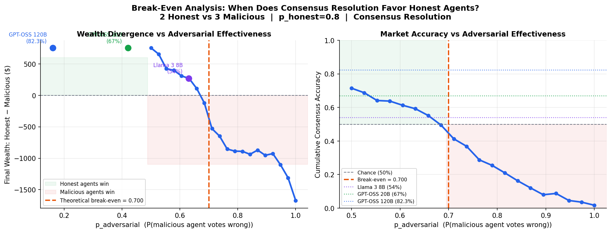
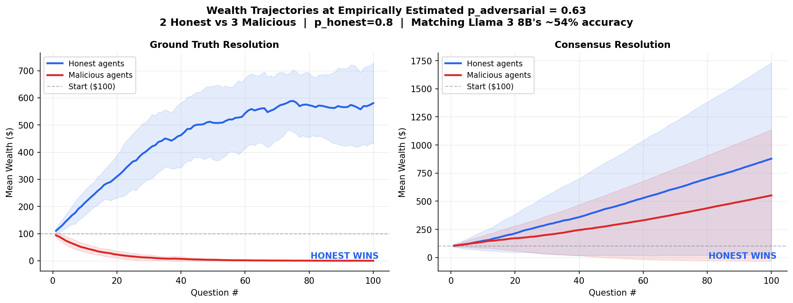
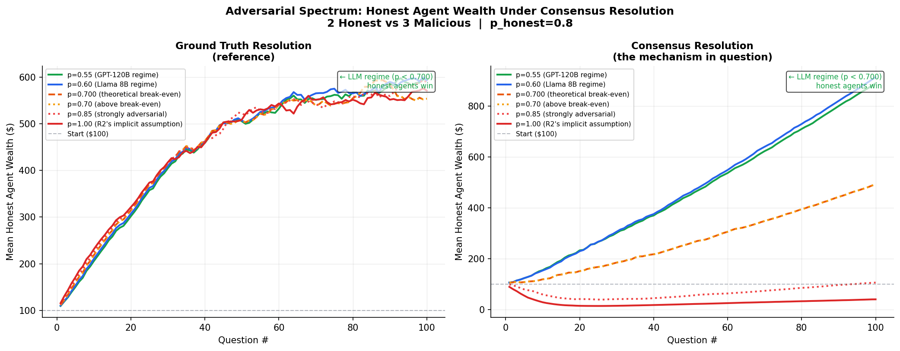
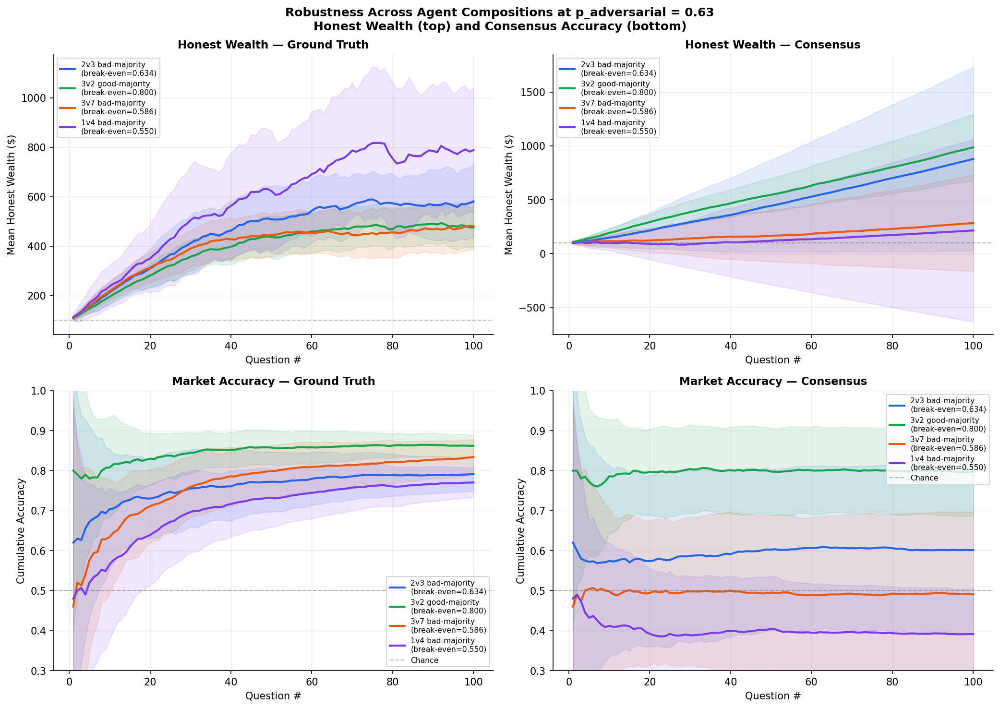
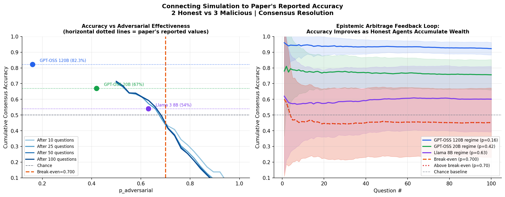

# Supplementary Results

This repository contains supplementary experimental data and simulation results
referenced in the paper review response.

---

## 1. Standalone Single-Agent Baselines

Single Llama 3.1 8B Instruct agent on binary pairwise format (3 independent runs,
deterministic inference). Validates that the evaluation format is correctly calibrated
against published benchmarks.

| Dataset | Standalone Acc | 95% CI |
|---------|---------------|--------|
| TruthfulQA (binary pairwise) | **70.2%** | ±1.7% [68.5%, 71.9%] |
| GPQA Binary | **49.8%** | ±2.6% [47.3%, 52.4%] |

*TruthfulQA result is consistent with the published MC2 score of 68.3% (Open LLM Leaderboard, difference +1.9%).*

---

## 2. Confidence Intervals — Llama 3 8B Adversarial Market Results

Market accuracy across adversarial configurations (3 independent runs, Llama 3 8B,
TruthfulQA and GPQA Binary):

| Scenario | Market Acc | 95% CI |
|----------|-----------|--------|
| TruthfulQA 3v2 Blind | 75.67% | ±5.10% [70.6%, 80.8%] |
| TruthfulQA 3v2 Informed | 52.00% | ±4.21% [47.8%, 56.2%] |
| TruthfulQA 2v3 Blind | 67.67% | ±4.85% [62.8%, 72.5%] |
| TruthfulQA **2v3 Informed** | **54.00%** | **±4.21% [49.8%, 58.2%]** |
| GPQA Binary 3v2 Blind | 56.00% | ±13.52% [42.5%, 69.5%] |
| GPQA Binary 3v2 Informed | 54.67% | ±2.44% [52.2%, 57.1%] |
| GPQA Binary 2v3 Blind | 57.67% | ±8.16% [49.5%, 65.8%] |
| GPQA Binary **2v3 Informed** | **39.13%** | **±6.94% [32.2%, 46.1%]** |
| GPQA MCQ 3v2 Blind | 29.00% | ±4.77% [24.2%, 33.8%] |
| GPQA MCQ 3v2 Informed | 28.33% | ±0.92% [27.4%, 29.3%] |
| GPQA MCQ 2v3 Blind | 32.67% | ±8.16% [24.5%, 40.8%] |
| GPQA MCQ 2v3 Informed | 21.33% | ±3.99% [17.3%, 25.3%] |

*Bold rows correspond to the primary results cited in the paper (Table 2 / Appendix Table 3).*

---

## 3. Semantic Market — Qwen Family Baselines (TruthfulQA)

Single-model baseline accuracy and market accuracy for the Qwen family on TruthfulQA,
from the semantic market baseline efficacy experiments (Table 1 of the paper):

| Model | Baseline | Market | Net Gain |
|-------|----------|--------|----------|
| Qwen 0.6B | 45.70% | 44.18% | −1.52% |
| Qwen 1.7B | 58.73% | 64.30% | +5.57% |
| Qwen 4B | 73.04% | 80.25% | +7.22% |
| Qwen 8B | 68.10% | 81.77% | +13.67% |
| Qwen 14B | 78.61% | 86.33% | +7.72% |
| Qwen 32B | 88.61% | 92.79% | +4.18% |
| Qwen 235B | 89.49% | 95.19% | +5.70% |

*Net gains match Table 1 of the paper exactly (verified from raw experimental counts).
The Qwen3 technical report does not include TruthfulQA evaluations; these numbers are
from our own experimental logs.*

---

## 4. Debate vs Market Scalability (Figure 5)

Market, debate, and voting accuracy across adversarial ratios (N=10 agents,
Blind Deception, Llama 3 8B, TruthfulQA). Extends Figure 5 of the paper
to include the debate baseline curve.

| Malicious (%) | Market | Debate | Vote |
|--------------|--------|--------|------|
| 1 (10%) | 77.0% | 72.3% | 59.7% |
| 2 (20%) | 74.7% | 70.3% | 63.0% |
| 3 (30%) | 75.3% | 68.3% | 54.0% |
| 4 (40%) | 74.0% | 65.3% | 56.0% |
| 5 (50%) | 68.3% | 63.7% | 58.3% |
| 6 (60%) | 72.7% | 64.3% | 49.3% |
| 7 (70%) | 72.3% | 68.7% | 49.3% |
| 8 (80%) | 65.0% | 68.0% | 49.0% |
| 9 (90%) | 58.3% | 67.7% | 55.0% |

*Market outperforms debate at adversarial ratios up to 70%. At 80–90% adversarial
in the Blind Deception setting, debate is marginally higher; the market's largest
advantage occurs in the Informed Deception setting (e.g. GPT-OSS 120B:
Market 82.3% vs Debate 46.7% at 2v3 Informed, Table 2 of the paper).*

---

## 5. Wealth Prompt Ablation

Effect of including agent wealth information in prompts (Llama 3.1 8B,
TruthfulQA, 2v3 Informed, 3 independent trials):

| Condition | Market Acc | SD | Malicious Wealth Share |
|-----------|-----------|-----|----------------------|
| No wealth in prompt (paper setup) | **73.3%** | ±7.2% | 33.3% |
| Wealth in prompt | 61.1% | ±3.1% | 67.2% |

*When adversarial agents are told their capital determines future market influence,
accuracy drops 12.2pp and malicious wealth capture nearly doubles. This confirms
the paper's no-wealth design prevents a class of strategic exploitation that
wealth-aware adversaries can execute.*

---

## 6. Break-Even Analysis (Monte Carlo Simulation)

The following plots show the theoretical break-even for consensus resolution
under adversarial agent compositions. All plots generated from the Monte Carlo
simulation (`sim.py`): N=50 seeds, binary market, 100 questions per trial,
LMSR liquidity parameter b=100.

### Plot 1 — Break-Even Curve

The y-axis shows final wealth gap (honest − malicious) and market accuracy
as a function of adversarial effectiveness `p_adversarial` (2 honest vs 3
malicious, p_honest=0.80). The dashed vertical line marks the theoretical
break-even. Real LLM estimates (Llama 3 8B ≈ 0.63, GPT-OSS 20B ≈ 0.42,
GPT-OSS 120B ≈ 0.17) all fall in the honest-wins region.

### Plot 2 — Wealth Trajectories at Estimated LLM Parameters

Honest and malicious agent wealth over 100 questions at p_adversarial=0.63
(matching Llama 3 8B's observed 54% accuracy). Both ground-truth and
consensus resolution show honest agents accumulating wealth.

### Plot 3 — Adversarial Spectrum

Honest agent wealth trajectories across the full range of p_adversarial
values, showing the qualitative transition at the break-even point.

### Plot 4 — Robustness Across Agent Compositions

Honest agent wealth and market accuracy across multiple agent compositions
(2v3, 3v2, 3v7, 1v4) at p_adversarial=0.63.

### Plot 5 — Empirical Calibration

Simulation accuracy as a function of p_adversarial at different episode
counts, with paper-reported accuracy values for each model marked.
Shows the epistemic arbitrage feedback loop: accuracy improves as
honest agents accumulate wealth.

---

## Data Files

| File | Contents |
|------|----------|
| `data/llama8b_adversarial_results.json` | Full Llama 3 8B adversarial results with CIs |
| `data/gptoss_120b_results.json` | GPT-OSS 120B market results |
| `data/gptoss_20b_results.json` | GPT-OSS 20B market results |
| `data/gptoss_120b_baselines.json` | GPT-OSS 120B debate/vote baselines |
| `data/gptoss_20b_baselines.json` | GPT-OSS 20B debate/vote baselines |
| `data/spectrum_results.json` | Figure 5 scalability data (N=10, 1–9 malicious) |
| `data/standalone_baseline.json` | Standalone single-agent baseline results |
| `data/wealth_ablation.json` | Wealth prompt ablation results |
| `traces/semantic_standard_sample.jsonl` | Semantic market conversation traces (standard) |
| `traces/semantic_adversarial_sample.jsonl` | Semantic market conversation traces (adversarial) |
| `traces/lmsr_sample.jsonl` | LMSR episode traces with per-agent reasoning |
